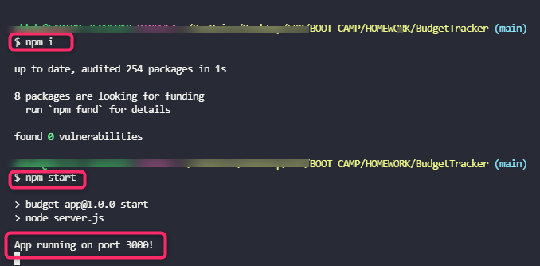

# Budget Smart #

·[**View Site**](https://git.heroku.com/budgetsmart.git/)·

<!-- TABLE OF CONTENTS -->
[**Table of Contents**](Contents)

* [About](#about)
* [Built With](#BuiltWith)
* [Installation](#Installation)
* [Usage](#Usage)
* [Links](#Links)

<!-- ABOUT THE PROJECT -->
## About ##

---

Giving users a fast and easy way to track their money is important, but allowing them to access that information anytime is even more important. Having offline functionality is paramount to our applications success.

### Built With ###

---

* [Express](https://expressjs.com/)
* [Compression](https://www.npmjs.com/package/compression)
* [lite-server](https://www.npmjs.com/package/lite-server)
* [Mongoose](https://mongoosejs.com/)
* [Morgan](https://www.npmjs.com/package/morgan)
   

### Installation ###

---

> 

## Usage ##

---

The user will be able to add expenses and deposits to their budget with or without a connection. When entering transactions offline, they should populate the total when brought back online.

 **Offline Functionality:**

* Enter deposits offline

* Enter expenses offline

 **When brought back online:**

* Offline entries should be added to tracker.

### Links ###

---

* Github Repo: <https://github.com/SarahKubik/BudgetTracker.git>
* Heroku App: <https://git.heroku.com/budgetsmart.git>
